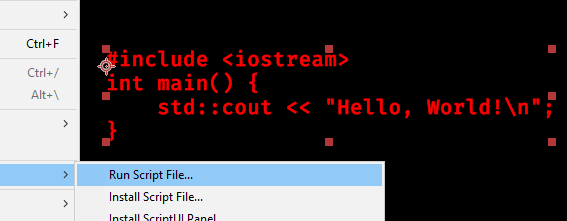
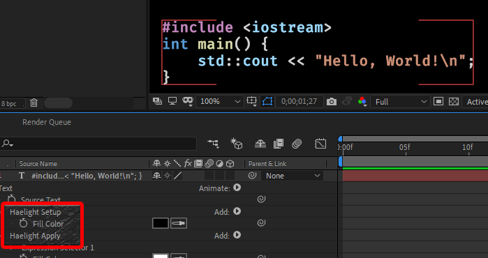

# hAElight
Syntax highlighting for C++ code in After Effects text layers.

I can't seem set colours at a character level in After Effects scripting, so the underlying technology is a bit ... unconventional. Also, hAElight does not properly parse the code, so you may get some funky results if you're unlucky.

But usually it works.

## Installation
Download [haelight.jsx](haelight.jsx), put it somewhere you can find it, then use as described below. Optionally, "install" it in After Effects using `File > Scripts > Install Script File...`.

## Usage
Select one or more text layers in After Effects, then run `haelight.jsx` using:
* `File > Scripts > Run Script File...`, or
* `File > Scripts > haelight.jsx` if you have installed it.





The script looks at the current contents of the text layer and stores the colours based on the _position_ in the text; the colours are not associated to the characters themselves. As a result, if you change the text of the layer, everything will become messed up and you should:
1. Remove the `Haelight Setup` and `Haelight Apply` animators from the layer, and
2. run hAElight again on it again.

## Configuring the colours

There is currently no UI to configure the colours; look at the top of `haelight.jsx` and change the `colors` list. Colours are given as three numbers `[red,green,blue]`, where each is between 0 and 1.

## Under the hood

I wasn't able to figure out how to set text colour on a character level from After Effects scripting. That would have been the sensible way to do this.

Doing the actual syntax analysis "live" in After Effects animators and expressions turned out to be very slow and/or imprecise. (Fair enough.)

So here's the ridiculous way to do it. We first figure out the colours we want. (Using regular expressions, so it's a bit fickle.)
Then we generate an animator expression that assigns characters a colour based on their position (offset) in the string. Making a big array with the colour of each character results in a very large expression and was still very slow. But the colours don't change _that_ often, so we can make an expression that searches the (much shorter) list of changes given the `textIndex`. _Actually,_ we bake a binary search with nested if statements. For example, for

    0123456789012345678901   <-- offset
    return “foo”;//comment   <-- text

we generate the following expression (pretty printed for readability).

```javascript
    var i = textIndex - 1;
    if (i < 12)
    {
       if (i < 7)
          [ 0.77, 0.53, 0.75 ];
       else
          [ 0.81, 0.57, 0.47 ];
    }
    else
    {
       if (i < 13)
          [ 0.83, 0.83, 0.83 ];
       else
          [ 0.42, 0.60, 0.33 ];
    }
```

Is this a weird way to do it? Yes. But here we are.

If we want to make the expression smaller and/or faster:
* To improve expression length, we could include a binary search function in the expression and have it search a list, rather than repeating all the ifs and elses. This would be a win for longer lists (but it needs to amortise the search code).
* To improve expression length, we could factor out the color constants and go through a lookup table: an index into the table is smaller than the literal. This would also make it easier to tweak colours after the fact in the expression itself. This would be a win for longer lists (but it needs to amortise the overhead of including the table).
* To improve the runtime of the expression, we could bias the search procedure using Huffman coding, so we get to large intervals more quickly. We _know_ the expression gets evaluated once for each `textIndex`...